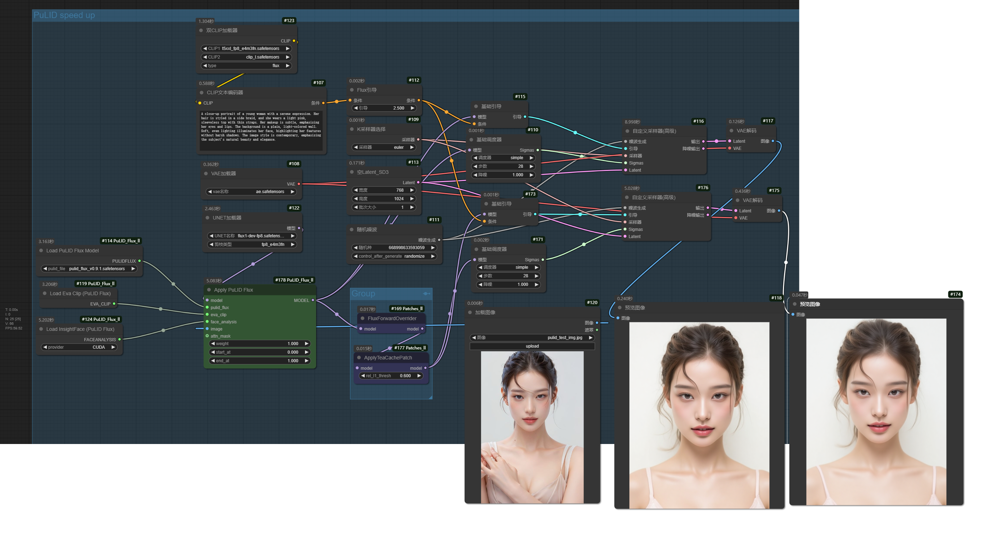

[中文文档](README_CN.md)

Add some hooks method. Such as: `TeaCache` for `PuLID-Flux|Flux|HunYuanVideo`.

## Preview (Image with WorkFlow)


Working with `PuLID` (need my other custom nodes [ComfyUI_PuLID_Flux_ll](https://github.com/lldacing/ComfyUI_PuLID_Flux_ll))



## Install

- Manual
```shell
    cd custom_nodes
    git clone https://github.com/lldacing/ComfyUI_Patches_ll.git
    # restart ComfyUI
```

## Nodes
- FluxForwardOverrider
  - Add some hooks method support to the `Flux` model
- VideoForwardOverrider
  - Add some hooks method support to the video model. Support `HunYuanVideo`
- DitForwardOverrider
  - Auto add some hooks method for model (automatically identify model type). Support `Flux`, `HunYuanVideo`
- ApplyTeaCachePatch
  - Use the `hooks` provided in `*ForwardOverrider` to support `TeaCache` acceleration. Support `Flux`, `HunYuanVideo`

## Thanks

[TeaCache](https://github.com/ali-vilab/TeaCache)
