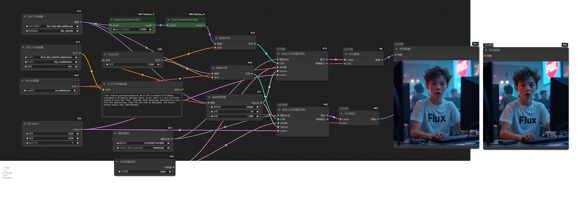
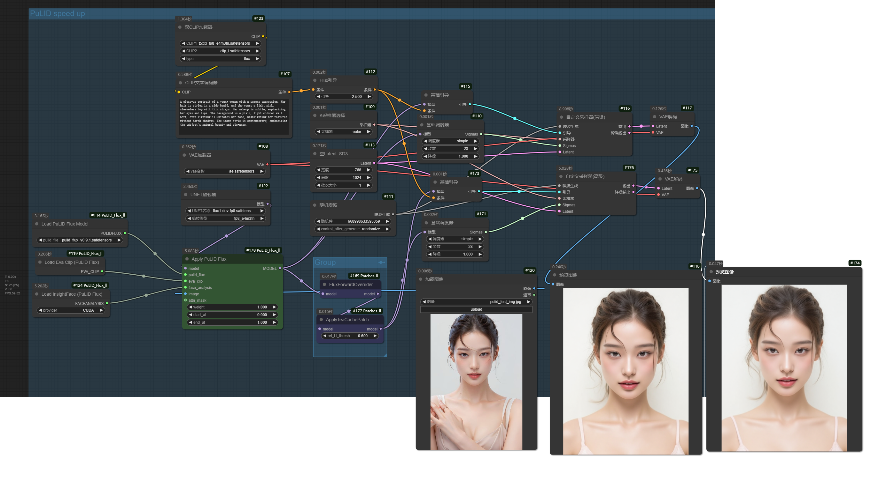

[English](README.md)

添加一些钩子方法。例如支持`TeaCache`和`First Block Cache`加速`PulID-Flux`、`Flux`、`混元视频`、`LTXVideo`、`MochiVideo`、`WanVideo`。

ComfyUI主体版本需要>=0.3.7

## 预览 (图片含工作流)


加速`PuLID` (需要配合我的另一插件 [ComfyUI_PuLID_Flux_ll](https://github.com/lldacing/ComfyUI_PuLID_Flux_ll)使用)



## 安装

- 手动安装
```shell
    cd custom_nodes
    git clone https://github.com/lldacing/ComfyUI_Patches_ll.git
    # restart ComfyUI
```

## 节点
- FluxForwardOverrider
  - 为`Flux`模型增加一些`hook`方法
- VideoForwardOverrider
  - 为视频模型添加一些`hook`方法. 支持 `HunYuanVideo`、 `LTXVideo`、`MochiVideo`、`WanVideo`
- DitForwardOverrider
  - 为Dit架构模型增加一些`hook`方法(自动识别模型类型). 支持 `Flux`、 `HunYuanVideo`、 `LTXVideo`、`MochiVideo`、`WanVideo`
- ApplyTeaCachePatch
  - 使用`*ForwardOverrider`中支持的`hook`方法提供`TeaCache`加速，支持 `Flux`、 `HunYuanVideo`、 `LTXVideo`、`MochiVideo`、`WanVideo`
  - 我测试结果，`MochiVideo`可能加速失败，加速后视频质量不太好，可能出现全黑视频
- ApplyTeaCachePatchAdvanced
  - 支持设置 `start_at` 和 `end_at`
- ApplyFirstBlockCachePatch
  - 使用`*ForwardOverrider`中支持的`hook`方法提供`First Block Cache`加速，支持 `Flux`、 `HunYuanVideo`、 `LTXVideo`、`MochiVideo`、`WanVideo`
  - 我测试结果，`MochiVideo`可能加速失败，加速后视频质量不太好，可能出现全黑视频
- ApplyFirstBlockCachePatchAdvanced
  - 支持设置 `start_at` 和 `end_at`

## 加速参考
### TeaCache (rel_l1_thresh值)
|              | 原始速度 | 1.5x | 1.8x | 2.0x |
|--------------|------|------|------|------|
| Flux         | 0    | 0.25 | 0.4  | 0.6  |
| HunYuanVideo | 0    | 0.1  | -    | 0.15 |
| LTXVideo     | 0    | 0.03 | -    | 0.05 |
| MochiVideo   | 0    | 0.06 | -    | 0.09 |
| WanVideo     | 0    | -    | -    | -    |
注: "-" 表示加速不明显、低质量或未测试。WanVideo的不同模型加速效果有差异。

### First Block Cache (residual_diff_threshold value)
|              | 原始速度 | 1.2x | 1.5x | 1.8x |
|--------------|------|------|------|------|
| Flux         | 0    | -    | -    | 0.12 |
| HunYuanVideo | 0    | -    | 0.1  | -    |
| LTXVideo     | 0    | 0.05 | -    | -    |
| MochiVideo   | 0    | -    | 0.03 | -    |
| WanVideo     | 0    | -    | 0.05 | -    |

注: "-" 表示加速不明显、低质量或未测试。

## 感谢

[TeaCache](https://github.com/ali-vilab/TeaCache) 
[ParaAttention](https://github.com/chengzeyi/ParaAttention) 
[Comfy-WaveSpeed](https://github.com/chengzeyi/Comfy-WaveSpeed) 
